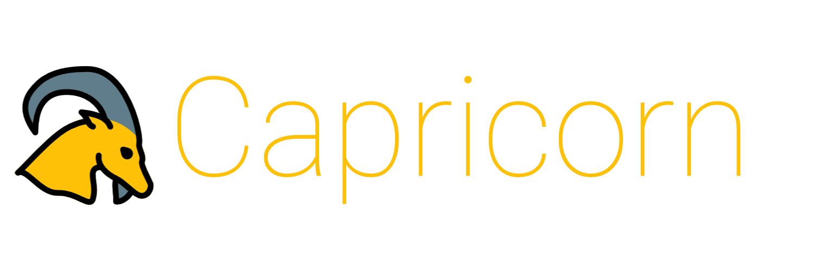
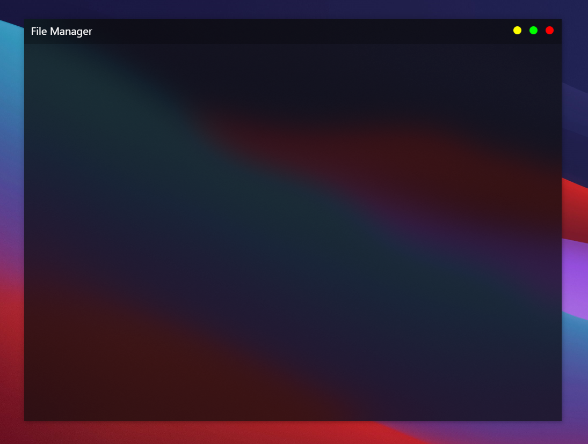
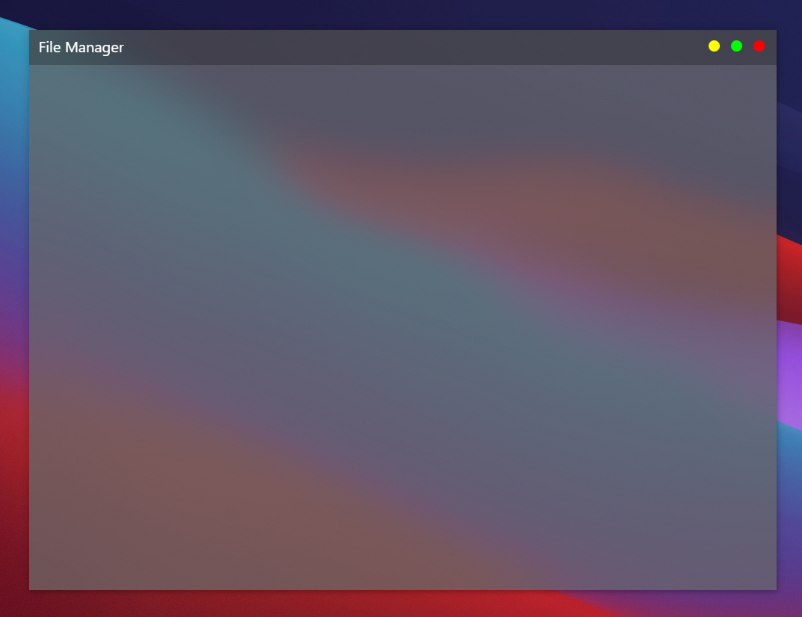

A highly customizable File Manager with blur and transparency. You can even make your own custom titlebar!
Made with Svelte and Electron.

### Screenshot

Windows (with custom OSX like titlebar, blur type: blurbehind)

Windows (with custom OSX like titlebar, blur type: acrylic)  
Dark  
  
Light  

### Important

~~Acrylic blur does not work on Windows, see [this issue](https://github.com/AryToNeX/Glasstron/issues/59#issuecomment-757432053). May implement in the future.~~

Acrylic blur works!

This is still a work in progress! Screenshots show how much progress has been made.

### Credits

Icon made by <a href="https://www.flaticon.com/authors/pixel-perfect" title="Pixel perfect">Pixel perfect</a> from <a href="https://www.flaticon.com/" title="Flaticon">www.flaticon.com</a>

